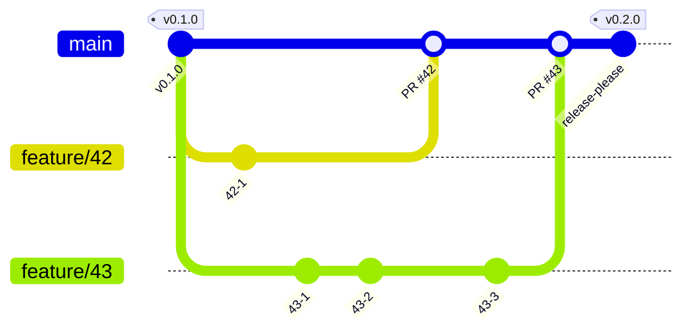

# 開発の準備

必要なものは、Node.js の 22.12 以上、pnpm、microsoft/apm の 3 つである。

```sh
pnpm install
apm install
```

- `pnpm install` は、Git のフックも有効にする。
- `apm install` は、`apm.yml` に書いたスキルを配置する。配置先と直し方は [スキルの置き場所](context/skills.md) に書いてある。
- microsoft/apm の導入の方法は、公式の案内に従う。
  - 出典: [microsoft/apm](https://github.com/microsoft/apm)
- 常設せずに試す場合は、uv の一時実行が使える。

```sh
uvx --from apm-cli apm install
```

## 文書を直すとき

```sh
pnpm lint:text
```

対象は、ルート、`adr/`、`design/`、`context/`、`skills/` の Markdown である。  
書き方の規則は `skills/docs-writing/SKILL.md` にある。

## コミットするとき

- コミットの前に、ステージした Markdown を textlint でチェックする。
- コミットメッセージは commitlint でチェックする。Conventional Commits の形式に加えて、要約の末尾の句点と、AI の帰属表示を禁止している。
- メッセージの書き方と変更の分け方は `skills/git-commit/SKILL.md` にある。
- ブランチの切り方と main への取り込み方は、[ブランチとリリース](#ブランチとリリース)の節にある。

## ブランチとリリース

ブランチは、main と、issue ごとの作業用のブランチだけにする。

- 作業用のブランチの名前は `feature/<issue 番号>` にする。例は `feature/6`。不具合の issue は `fix/<issue 番号>` にする。
- main へは、変更の依頼を通して取り込む。マージの方法はマージコミットだけで、取り込んだブランチは消す。
- main へ直接コミットしてよいかは、`context/project.yml` の `guardrails.protected_branches.direct_commit` で宣言する。

バージョンは、セマンティック バージョニングに従う。リポジトリ全体で 1 つのバージョンにする。  
バージョンの決定とタグ付けには release-please を使う。コミットメッセージから次のバージョンを決め、リリース用の変更の依頼を作る。

- ADR-0007: [main と作業用のブランチだけで運用し、release-please でタグを付ける](adr/0007-branch-and-release.md)

次の図は、実装に移った後のブランチの構成を示す。main は常にリリースできる状態に保つ。作業用のブランチは main から切り、変更の依頼で main へ戻す。タグは、release-please が main のコミットに付ける。



これは、このリポジトリ自身の選択である。利用者のブランチ運用と、バージョンの付け方は、利用者が決める。

## issue と変更の依頼

- 作業は issue から始める。`.github/ISSUE_TEMPLATE/` の form で起票する。form が種類のラベル `type:*`（`requirements`、`task`、`bug`）を付けるので、パッケージのラベル `pkg:*` を足す。GitHub の milestone は使わない。タスクは親の要求の sub-issue にする。
- 設計が要る作業だけ、`specs/<issue 番号>-<短い主題>/` に spec と `process.yml` を置く。それ以外は `context/project.yml` の既定の選択のまま進め、進み具合は issue の状態で表す。
- issue の題には、扱うプロセスの接頭辞を付ける。【要求】【設計】【実装】【検証】【不具合】である。
- 変更の依頼は 1 つの issue に対応させ、作業を始めた時点で Draft として作る。本文の先頭に `Closes #<番号>` を書き、題は issue の題と同じにする。本文の節は `.github/pull_request_template.md` にあり、書き方は `skills/issue-pr-writing/SKILL.md` にある。
