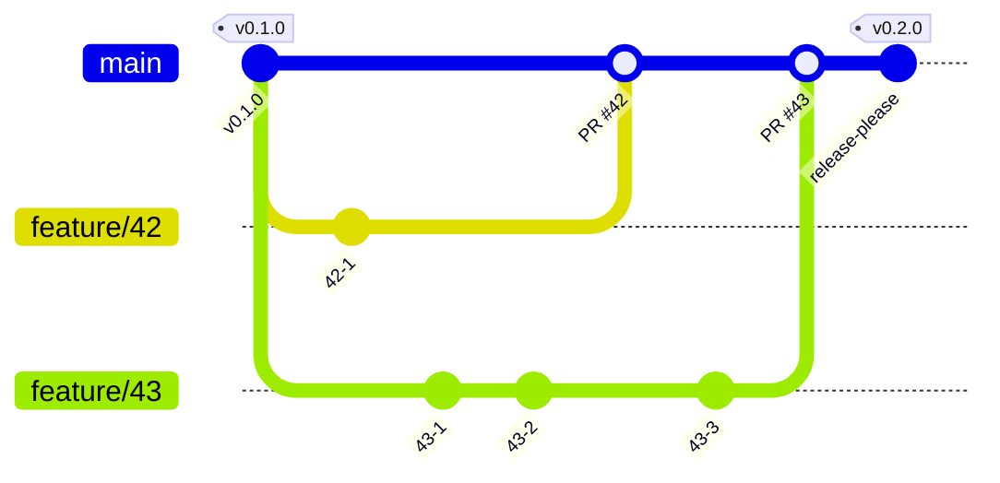
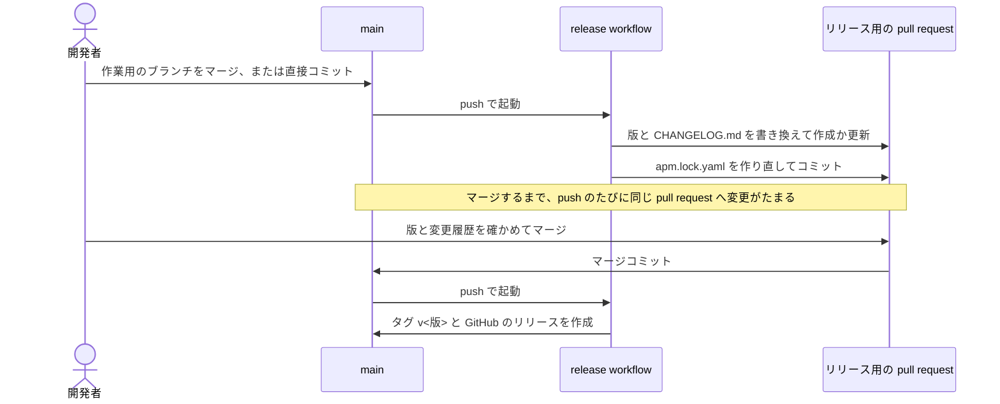

# 開発の準備

必要なものは mise だけである。Node.js、pnpm、microsoft/apm は、mise が `mise.toml` の版で入れる。

```sh
mise trust
mise install
pnpm install
apm lifecycle trust
apm install
```

- `mise trust` は、clone した直後に 1 度だけ要る。設定ファイルを信頼させる。
- `pnpm install` は、Git のフックも有効にする。
- `apm lifecycle trust` は、マシンごとに 1 度だけ要る。`apm.yml` の post-install を信頼させ、`apm install` の後に配置先を `.gitignore` に足させる。
- `apm install` は、`apm.yml` に書いたスキルとパッケージを配置する。配置先と直し方は [スキルの置き場所](context/skills.md) に書いてある。
- mise の導入の方法は、公式の案内に従う。
  - 出典: [mise](https://mise.jdx.dev/)
  - ADR-0016: [ツールの版は mise で管理し、テンプレートの既定にする](adr/0016-mise-for-tool-versions.md)

## 設計と取り決めの置き場

- [PRD](PRD.md): 誰のどの課題を、何で解決するか。
- [Design Doc](design/DesignDoc.md): 全体の構成と、パッケージに共通する方針。パッケージごとの設計は `packages/<名前>/DesignDoc.md` にある。
- [adr/](adr/): 選択肢を比較して決めた判断。
- [context/](context/index.md): 作業の中で参照する規約と事実。コーディングエージェントごとの違いは [コーディングエージェントごとの対応](context/coding-agents.md) にある。

## 文書を直すとき

```sh
pnpm lint:text
```

対象は、ルート、`adr/`、`design/`、`context/`、`skills/` の Markdown である。  
書き方の規則は、スキル write-prose と、[コードと文書の規約](context/conventions.md) の Documents の節にある。

`context/` と `design/` の文書を足したり frontmatter を変えたりしたら、目次を生成し直す。

```sh
pnpm check:index --write
```

目次の `context/index.md` は手で編集しない。コミットの前のフックが目次を生成し直してステージする。CI は、目次が frontmatter と合わないと失敗する。

経緯の混入とリンク切れは、次のコマンドで確かめる。CI も同じチェックを動かす。

```sh
pnpm check:history
pnpm check:links
```

`verified_commit` の後に実装が変わった文書は、`pnpm list:drift` で一覧する。実装と読み比べてから `verified_commit` を進める。

## コミットするとき

- コミットの前に、ステージした Markdown を textlint でチェックする。
- コミットメッセージは commitlint でチェックする。Conventional Commits の形式に加えて、要約の末尾の句点と、AI の帰属表示を禁止している。
- メッセージの書き方と変更の分け方は、スキル write-commit にある。
- ブランチの切り方と main への取り込み方は、[ブランチとリリース](#ブランチとリリース)の節にある。

## ブランチとリリース

ブランチは、main と、issue ごとの作業用のブランチだけにする。

- 作業用のブランチの名前は `feature/<issue 番号>` にする。例は `feature/6`。不具合の issue は `fix/<issue 番号>` にする。
- main へは、pull request を通して取り込む。マージの方法はマージコミットだけで、取り込んだブランチは消す。
- main へ直接コミットしてよいかは、`context/project.yml` の `guardrails.protected_branches.direct_commit` で宣言する。

バージョンは、セマンティック バージョニングに従う。リポジトリ全体で 1 つのバージョンにする。  
版は `<major>.<minor>.<patch>` の 3 つの数で、利用者のリポジトリで手直しが要る変更は major を、機能の追加は minor を、不具合の修正は patch を上げる。  
1.0 より前は、セマンティック バージョニングが何でも変わりうる初期の開発の期間と定めているので、1 つずつ下の桁で上げる。

- 出典: [Semantic Versioning 2.0.0](https://semver.org/lang/ja/)

バージョンの決定とタグ付けには release-please を使う。コミットメッセージから次のバージョンを決め、リリース用の pull request を作る。  
リリース用の pull request をマージすると、タグとリリースができる。

- ADR-0007: [main と作業用のブランチだけで運用し、release-please でタグを付ける](adr/0007-branch-and-release.md)
- ADR-0019: [packages/ を変えたコミットだけで版を上げ、切り戻しは新しい版で行う](adr/0019-release-scope-and-rollback.md)

版が上がるのは、`packages/` の下を変えたコミットだけ。コミットの type と、上がる版の桁の対応は次のとおり。

| コミットの type | 1.0 より前 | 1.0 以降 | 変更履歴の節 |
| --- | --- | --- | --- |
| type の後に `!`、または本文に `BREAKING CHANGE:` | minor | major | BREAKING CHANGES |
| `feat` | patch | minor | Features |
| `fix` | patch | patch | Bug Fixes |
| `perf`、`revert`、`docs` | patch | patch | 各 type の節 |
| `chore`、`refactor`、`test`、`build`、`ci`、`style` | patch | patch | 載らない |

- 変更履歴に載るコミットが 1 つもないと、リリース用の pull request は作られない。`chore` や `refactor` だけでは、版は上がらない。
- 1.0 より前の上げ方は、`release-please-config.json` の `bump-minor-pre-major` と `bump-patch-for-minor-pre-major` で決まる。

次の変更は、利用者のリポジトリで手直しが要るので破壊的な変更とする。type の後に `!` を付け、本文に `BREAKING CHANGE:` を書く。

- スキルの改名と削除
- `context/project.yml` の schema と互換のない変更
- テンプレートを写す先と、フックの登録の形の変更

取り込んだ変更を取り消すときは、取り消すコミットの type と scope を引き継ぎ、`revert(<scope>): <要約>` の形で書く。  
`git revert` の既定のメッセージ `Revert "..."` は commitlint を通るが、release-please が解析できず、取り消しが新しい版に入らない。

次の図は、実装に移った後のブランチの構成を示す。main は常にリリースできる状態に保つ。作業用のブランチは main から切り、pull request で main へ戻す。タグは、release-please が main のコミットに付ける。


```mermaid
gitGraph
    commit id: "v0.1.0" tag: "v0.1.0"
    branch "feature/42"
    checkout "feature/42"
    commit id: "42-1"
    checkout main
    branch "feature/43"
    checkout "feature/43"
    commit id: "43-1"
    commit id: "43-2"
    checkout main
    merge "feature/42" id: "PR #42"
    checkout "feature/43"
    commit id: "43-3"
    checkout main
    merge "feature/43" id: "PR #43"
    commit id: "release-please" tag: "v0.2.0"
```

これは、このリポジトリ自身の選択である。利用者のブランチ運用と、バージョンの付け方は、利用者が決める。

### リリースの流れ

main へ push するたびに、`.github/workflows/release.yml` がリリース用の pull request を作るか更新する。作業用のブランチのマージも、main への直接のコミットも同じ扱いになる。  
リリース用の pull request は常に 1 つで、マージするまで変更がたまる。タグとリリースができるのは、この pull request をマージしたときだけ。

- `packages/` の外だけを変えた push では、リリース用の pull request は変わらない。
- 次の版は、前のリリースより後のコミットのうち、最も大きい変更で決まる。`feat` と `fix` が何件あっても、1 回のリリースで上がるのは 1 段だけ。例は `0.1.0` から `0.1.1`。
- main へ直接コミットしたコミットも、作業用のブランチの中のコミットと同じく 1 つずつ読まれる。Conventional Commits の形でないメッセージは読まれず、版にも変更履歴にも入らない。
- 版を書き換えるコミットの後に、workflow が `apm.lock.yaml` を作り直してコミットする。その前のコミットの CI は、lock のずれで失敗する。

次の図は、main への push から、タグとリリースができるまでの流れを示す。


```mermaid
sequenceDiagram
    actor Dev as 開発者
    participant Main as main
    participant WF as release workflow
    participant PR as リリース用の pull request
    Dev->>Main: 作業用のブランチをマージ、または直接コミット
    Main->>WF: push で起動
    WF->>PR: 版と CHANGELOG.md を書き換えて作成か更新
    WF->>PR: apm.lock.yaml を作り直してコミット
    Note over Main,PR: マージするまで、push のたびに同じ pull request へ変更がたまる
    Dev->>PR: 版と変更履歴を確かめてマージ
    PR->>Main: マージコミット
    Main->>WF: push で起動
    WF->>Main: タグ v<版> と GitHub のリリースを作成
```

リリースするときは、次の順に進める。

1. リリース用の pull request（題は `chore(main): release <版>`）を開き、版と `CHANGELOG.md` の変更を確かめる。
2. `apm.lock.yaml` の版が `plugin.json` と合っていて、最新のコミットの CI が通っていることを確かめる。
3. マージコミットでマージする。
4. release workflow が終わったら、`gh release view v<版>` でタグとリリースができたことを確かめる。
5. release workflow が失敗したときは、GitHub の Actions の画面で失敗した実行を再実行する。

## issue と pull request 

- 作業は issue から始める。`.github/ISSUE_TEMPLATE/` の form で起票する。form が種類のラベル `type:*`（`requirements`、`task`、`bug`）を付けるので、パッケージのラベル `pkg:*` を足す。GitHub の milestone は使わない。タスクは親の要求の sub-issue にする。
- 設計が要る作業だけ、`specs/<issue 番号>-<短い主題>/` に spec と `process.yml` を置く。それ以外は `context/project.yml` の既定の選択のまま進め、進み具合は issue の状態で表す。
- pull request は 1 つの issue に対応させ、作業を始めた時点で Draft として作る。
- issue と pull request の題と本文の書き方は、スキル write-issue-pr にある。
- pull request のレビューには Codex が付く。指摘は対応して返信する。返信の書き方は、スキル write-issue-pr の共通の節に従う。
