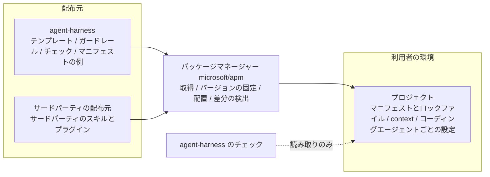

# agent-harness Design Doc

**Status:** Draft

**Owner:** Fukuemon

**Reviewers:** 未定

## 概要

agent-harness は、AI エージェントにプロジェクト固有の知識とガードレールを与えるパッケージである。  
進め方の標準も定める。具体のワークフローのハーネスは、利用者が選んで併せて導入する。

対象のコーディングエージェントは Claude Code と Codex CLI である。Cursor は可能な範囲で対応する。

## リポジトリの構成

```text
agent-harness/
├── .claude-plugin/
│   └── marketplace.json        パッケージの一覧
├── packages/
│   └── <パッケージの名前>/
│       ├── .claude-plugin/
│       │   └── plugin.json
│       ├── skills/
│       │   └── <スキルの名前>/
│       │       ├── SKILL.md
│       │       └── assets/     利用者のリポジトリへ写すテンプレート
│       └── hooks/              hooks.json と、フックが呼ぶスクリプト
├── lefthook/
│   └── <パッケージの名前>.yml  lefthook の remotes で配る設定
├── .lefthook/                  Git のフックが呼ぶスクリプト
├── skills/                     このリポジトリの開発に使うスキル
├── adr/
├── PRD.md
├── DesignDoc.md
├── apm.yml
└── apm.lock.yaml
```

- パッケージは、`packages/` の下に 1 つずつ置く。形は Claude Code の形式のプラグインである。
- ルートの一覧は、Claude Code と Codex CLI の標準の方法で導入する利用者が使う。
- Git のフックの設定は `lefthook/` に、Git のフックが呼ぶスクリプトは `.lefthook/` に置く。lefthook の `remotes` は、配る側のリポジトリのルートにあるスクリプトだけを配れる。
- パッケージ同士は依存させない。

## 設計の前提

- Codex CLI と Cursor は AGENTS.md を読む。Claude Code は v2.1.277 以降、CLAUDE.md がないリポジトリで AGENTS.md を直接読む。CLAUDE.md がある場合は CLAUDE.md だけを読む。
  - [How Claude remembers your project](https://code.claude.com/docs/en/memory)
- 規約ファイルの指示は助言にとどまる。フックは必ず実行される。
  - [Best practices for Claude Code](https://code.claude.com/docs/en/best-practices)
- マニフェストとロックファイルによる再現、差分の検出、複数のコーディングエージェントへの配置は、公開のパッケージマネージャーが提供している。

## 全体の構成

agent-harness のリポジトリは配布元である。  
取得と配置はパッケージマネージャーが行う。  
agent-harness のチェックは、利用者の環境を読み取るだけで変更しない。



パッケージマネージャーには microsoft/apm を使う。  
マニフェストはリポジトリのルートの `apm.yml`、ロックファイルは `apm.lock.yaml` である。どちらも Git で管理する。

サードパーティの拡張機能は、使うプロジェクトのマニフェストに書く。global には入れないことを既定にする。  
配置された拡張機能のファイルは Git で管理しない。clone の後に、導入のコマンドを 1 度実行する。

パッケージマネージャーは 1 つだけ使う。  
複数を併用すると、同じスキルの置き場所、同じフックの設定、同じ規約ファイルへ書き込み、ロックファイルも複数になる。どれが正しいか分からなくなる。

パッケージは、特定のワークフローのハーネスを前提にしない。利用者がどのワークフローのハーネスを導入しても、衝突しない。

## 構成要素

構成要素は互いに依存させない。1 つを外しても残りが動く。

- **テンプレートとルール:** Design Doc、context、ADR、spec の構造と、どの情報をどの文書に書くかのルールを持つ。利用者の知識の中身は持たない。
- **文書のチェック:** 目次の生成、実装とずれた可能性の一覧、spec の消し忘れ、リンク切れを確認する。内容の正しさは判定しない。
- **ガードレール:** 保護ブランチの保護と、秘密情報の混入の防止をフックとして持つ。コーディングエージェントの権限の仕組みそのものは実装しない。
- **プロジェクトごとの値の定義:** 値を置くファイルの schema を持つ。値そのものは持たない。
- **マニフェストの例:** プロジェクトのマニフェストの例を持つ。取得、配置、更新は行わない。
- **補いのチェック:** パッケージマネージャーで確認できないことを確認する。環境は変更しない。

## ルールの持ち方

ルールは、機械で判定できるかどうかで持ち方を分ける。

- 機械で判定できるルールは、自動チェックで持つ。文章のルールには textlint を使う。
  - 文書を編集した後のフックと、CI で実行する。
  - スキルや AGENTS.md には、同じルールを書かない。
- 機械で判定できないルールは、領域ごとに 1 つのスキルにまとめる。文章、コミット、コードのコメントが領域の例である。スキルの本文は 150 行以内に保つ。
- フックで毎回コンテキストを追加するパッケージは作らない。
  - 変わらないルールをフックで足すのは、公式の文書が勧める使い方ではない。関係のない作業でもコンテキストを使い、守られたかも確かめられない。
- コードのコメントのルールは、ファイルの編集の後のフックで扱う。コメントが足されたときだけ、確かめるよう促す文をコンテキストに追加する。編集は拒否しない。
  - 残してよいかの判断の基準は、スキル「code-comments」に書く。
  - このフックは、サブエージェントの中でも動く。
- AGENTS.md は、目次への参照と禁止事項だけを持つ。
- 同じことを 2 か所で指示しない。サードパーティのスキルやプラグインを入れるときは、既にあるルールと重ならないことを確かめる。
- モデルが指示なしで行うことは、どこにも書かない。

## 文書の体系

### 文書の種類と寿命

利用者のリポジトリに次の文書を置く。ディレクトリ名は、プロジェクトごとの値で変更できる。

- **Design Doc:** 全体像、モジュールの責務、機能ごとの設計。現在の設計だけを書く。
- **context:** 技術スタックの規約、コードベースの構造の取り決め、運用の取り決め。現在の取り決めだけを書く。
- **ADR:** 選択肢を比較して決めた判断とその理由。追記だけを行う。
- **spec:** issue ごとの要求、論点、受け入れ基準、決定の経緯。作業が終わったら削除する。
  - レビューを依頼する前に、1 本の HTML へ変換する。最終のセルフレビューが終わった後に行う。
  - 変換した HTML をコミットし、CI が変更の依頼ごとに公開する。レビューする人は、公開された URL を開いて読む。
  - HTML の骨組みは、テンプレートとしてパッケージに持つ。
  - 作業が終わったら、HTML も spec と同じく削除する。
- **プロジェクトごとの値:** コマンド、命名、ラベル、パスなど。

Design Doc、context、ADR は短く保ち、食い違ったときの唯一の参照先にする。  
spec は長くなりやすく、読み手が検証しきれない。残し続けると、どれが正しいか分からなくなる。  
そのため spec は、残す設計を移した後に削除する。

Design Doc、context、ADR から spec へリンクしない。spec は削除されるため、リンクは必ず切れる。  
未解決の論点を指す場合だけ issue 番号を書ける。論点が解決したら、その記述ごと消す。

### frontmatter

Design Doc と context は frontmatter を持つ。  
この形式は Open Knowledge Format に適合する。  
同仕様に依存するのは、必須の `type` と、予約されたファイル名の 2 点だけにする。`governs` と `verified_commit` は、同仕様が認める独自のキーである。

- [Open Knowledge Format 仕様](https://github.com/GoogleCloudPlatform/open-knowledge-format/blob/ad30107c31c06aec8a7d5636e0d1058118604e6f/SPEC.md)

キーは次のとおり。


| キー                | 必須  | 内容                                                 |
| ----------------- | --- | -------------------------------------------------- |
| `type`            | 必須  | 文書の種類                                              |
| `title`           | 必須  | 表示名                                                |
| `description`     | 必須  | 目次に出す 1 行の説明。何が書いてあるかを具体的に書く                       |
| `status`          | 任意  | `draft`、`stable`、`deprecated` のいずれか。省略したら `stable` |
| `keywords`        | 任意  | 検索の手掛かり                                            |
| `governs`         | 任意  | 文書が説明している実装の場所。コードに限らず、設定ファイルも指せる                  |
| `verified_commit` | 任意  | 最後に実装と比べて確認した commit。未確認なら `unverified`            |


`governs` と `verified_commit` は、両方を書くか、両方を省く。  
片方だけの状態は、チェックがエラーにする。  
何も報告せずに対象から外すと、その文書が一覧から抜けたことに気づけないためである。

手書きの更新日は持たない。日付は更新し忘れを検出できないが、commit と履歴の差分は検出できる。

### チェック


| チェック         | 内容                                                     | 失敗の扱い               |
| ------------ | ------------------------------------------------------ | ------------------- |
| 目次の生成        | frontmatter から目次を生成する。ファイル名は `index.md`。目次は手で編集しない     | 生成し直して差分が出たら失敗      |
| 実装とずれた可能性の一覧 | `verified_commit` より後に `governs` の範囲が変更された文書を一覧する      | 失敗にしない。一覧は見直しの作業リスト |
| spec の消し忘れ   | close 済みの issue に対応する spec と、レビュー用の HTML が残っていないかを確認する | 残っているファイルを報告        |
| 経緯の混入        | Design Doc と context に、変更履歴の節と解決済みの issue 番号がないかを確認する  | 該当の箇所を報告            |
| リンク          | 文書の中のリンク切れを確認する                                        | 失敗                  |


ずれの一覧を失敗にしないのは、範囲の中のコードが変わっても文書が正しいままの場合が日常的にあるからだ。  
失敗にすると、内容を読まずに `verified_commit` だけを進める運用が唯一の現実的な手段になり、チェックが形だけになる。

時間の経過だけで古いとみなす判定も入れない。  
安定した領域に警告が出続け、警告の全体が読まれなくなる。

### spec を削除する前の保証

作業を次へ進める制御を持たないため、残す設計を移す機会は、次の 3 つで守る。

- ルールを 1 つ置く。「spec を閉じる前に、残す設計を Design Doc と context へ、比較して決めた判断を ADR へ移す」
- spec の消し忘れのチェックで、削除されていない spec を報告する。
- issue の close をきっかけに、spec を削除する変更の提案を自動で作る。提案を取り込むかどうかの判断が、移し終えたことの確認になる。自動では削除しない。

### コーディングエージェントへの接続

- リポジトリのルートに AGENTS.md を置き、context の目次への参照を 1 か所だけ書く。AGENTS.md は目次への参照と禁止事項だけを持ち、ルールの本文は持たない。
- CLAUDE.md は置かない。CLAUDE.md を置くプロジェクトでは、CLAUDE.md から AGENTS.md を取り込む。
- 目次への参照は、取り込みの記法ではなくパスとして書く。取り込みの記法は起動時に展開され、常に読み込まれる量が増える。

エージェントが目次から必要な context を開く割合は未確認である。

## ガードレール

- **保護ブランチの保護:** 保護ブランチへの直接コミットと、保護ブランチを書き換える操作を拒否する。
  - 対象のブランチと、直接コミットを許す条件は、利用者が設定する。既定は拒否。
  - コーディングエージェントのツール実行前のフックと、Git のフックの両方で判定する。
- **秘密情報の混入の防止:** コミットと文書に、認証情報の形式に一致する文字列がないかを確認する。Git のフックで判定する。

保護ブランチを変更しない操作は拒否しない。  
同期や作業ツリーの復元まで止めると、ガードレールそのものが外される。

コーディングエージェントごとにフックの仕組みが違う。  
フックが必ず実行される保証のないコーディングエージェントでは、Git のフックだけが働く。  
コーディングエージェントごとの対応は、確認したコーディングエージェントのバージョンとともに対応表に記録する。

## プロジェクトごとの値

プロジェクトごとの値は、利用者のリポジトリの 1 つのファイルに置く。  
パッケージのスキルとチェックは、このファイルから値を読む。

ツールの具体は扱わない。  
リポジトリの管理や作業ツリーの管理に何を使うかは、利用者に委ねる。利用者が context に書いた内容は、モデルが解釈する。  
ツールごとのパッケージを作ると、パッケージの数が、利用者の使うツールの数に比例して増えるためである。

- ファイルの形式は YAML。schema を提供する。
- パッケージの本文に、製品名、リポジトリ名、コマンド、利用者によって違うツールの名前を直接書かない。チェックがこれを確認する。
- 必要な値が足りない場合、その値を使う処理は、足りないキーを表示して実行の前に止まる。

## 配布の形式

パッケージは、Claude Code の形式のプラグインにする。中のスキルは、Agent Skills の形式で書く。  
Agent Plugins の公式のスキーマは宣言しない。宣言すると、パッケージマネージャーが Claude Code と Codex CLI へ配置しなくなる。

利用者がパッケージを導入する方法は、3 つある。

- **パッケージマネージャー:** マニフェストに `Fukuemon/agent-harness/packages/<名前>` とタグを書く。バージョンの固定と再現ができる。
- **コーディングエージェントの標準の方法:** ルートの一覧から、プラグインを選んで導入する。Claude Code はプロジェクトの単位で、Codex CLI は利用者の単位で導入する。
- **lefthook の `remotes`:** Git のフックを使うパッケージで、利用者が自分の `lefthook.yml` に、このリポジトリの URL とタグを書く。

利用者のリポジトリへ写すテンプレートは、スキルの `assets/` に置く。スキルが、利用者の求めに応じて写す。  
パッケージマネージャー専用の形式は、マニフェストの例だけに使う。パッケージの本体には使わない。

## 進め方の標準

進め方の標準は、このリポジトリで管理する。具体のワークフローのハーネスは、別のリポジトリで管理する。

- このリポジトリが持つのは、取り決めと、節目で使う手段である。
  - 取り決めは、文書の種類と寿命、作業の節目、節目で行うチェックを定める。
  - 手段は、節目で実行するスクリプト、フック、テンプレートである。
- 作業を次の節目へ進める制御は、ワークフローのハーネスが持つ。ワークフローのハーネスは、このリポジトリのパッケージに依存する。
- 利用者は、マニフェストの行で、ワークフローのハーネスを選ぶ。自作のものも、サードパーティのものも、同じ書き方で導入できる。

## ブランチとリリース

ブランチは、main と、issue ごとの作業用のブランチだけにする。main へは、変更の依頼を通して取り込む。

バージョンは、セマンティック バージョニングに従う。リポジトリ全体で 1 つのバージョンにする。  
バージョンの決定とタグ付けには release-please を使う。コミットメッセージから次のバージョンを決める。

これは、このリポジトリ自身の選択である。利用者のブランチ運用と、バージョンの付け方は、利用者が決める。

## 関連ドキュメント

- [PRD](PRD.md) — 課題、目標、受け入れの条件
- [拡張機能のパッケージマネージャーに microsoft/apm を使う](adr/0001-management-tool.md) — 承認済みの ADR
- [context を Open Knowledge Format に適合させ、依存は 2 点に絞る](adr/0002-context-format.md) — 承認済みの ADR
- [spec はレビューを依頼する前に 1 本の HTML へ変換し、CI で公開してレビューする](adr/0003-spec-review-html.md) — 承認済みの ADR
- [サードパーティの拡張機能はプロジェクトの単位で宣言し、global は最小に保つ](adr/0004-third-party-extensions.md) — 承認済みの ADR
- [自動でチェックできるルールは textlint などに任せ、できないルールは 1 つのスキルにまとめる](adr/0005-rules-by-check-or-skill.md) — 承認済みの ADR
- [意味の判定が要るルールには、任意の追加として Jev を使う](adr/0006-semantic-check.md) — 提案の状態にある ADR
- [main と作業用のブランチだけで運用し、release-please でタグを付ける](adr/0007-branch-and-release.md) — 承認済みの ADR
- [進め方の標準はこのリポジトリに置き、具体のワークフローのハーネスは別のリポジトリに置く](adr/0008-workflow-harness.md) — 承認済みの ADR
- [パッケージは、用途ごとのプラグインとして packages/ の下に置く](adr/0009-package-layout.md) — 承認済みの ADR
- [How Claude remembers your project](https://code.claude.com/docs/en/memory) — Claude Code が AGENTS.md と CLAUDE.md を読む条件
- [Best practices for Claude Code](https://code.claude.com/docs/en/best-practices) — 規約ファイルの指示とフックの違い
- [Agent Skills 仕様](https://agentskills.io/specification) — スキルの形式

