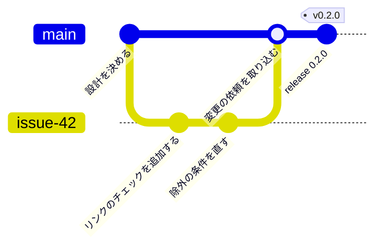

# ブランチとリリース

ブランチは、main と、issue ごとの作業用のブランチだけにする。

- 設計が固まり、タスクへの分解と実装に移るまでは、main へ直接コミットして push する。
- 実装に移った後は、main へは変更の依頼を通して取り込む。

バージョンは、セマンティック バージョニングに従う。リポジトリ全体で 1 つのバージョンにする。  
バージョンの決定とタグ付けには release-please を使う。コミットメッセージから次のバージョンを決め、リリース用の変更の依頼を作る。

- [main と作業用のブランチだけで運用し、release-please でタグを付ける](../adr/0007-branch-and-release.md)

次の図は、実装に移った後の、1 つの issue の作業からタグ付けまでの流れを示す。

これは、このリポジトリ自身の選択である。利用者のブランチ運用と、バージョンの付け方は、利用者が決める。
