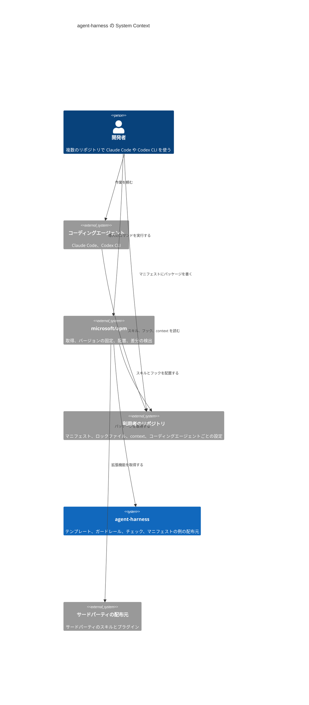

# agent-harness Design Doc

**Owner:** Fukuemon

**Reviewers:** 未定

## 概要

agent-harness は、AI エージェントにプロジェクト固有の知識とガードレールを与えるパッケージである。  
開発プロセスの標準も定める。具体のワークフローのハーネスは、利用者が必要に応じて選んで導入する。

対象のコーディングエージェントは Claude Code と Codex CLI である。Cursor は可能な範囲で対応する。

- [PRD](../PRD.md) — 課題、目標、受け入れの条件

この文書は全体像だけを持つ。機能ごとの設計は、[パッケージ](#パッケージ)の節から機能ごとの Design Doc へリンクする。

## 目標と非目標

この設計が提供するものは、次の 4 つである。

- パッケージを 1 つずつ導入でき、1 つずつ外せる。
- 特定のパッケージマネージャーに依存しない形式で配る。
- モデルが進化しても要る内容だけを持つ。プロジェクト固有の知識、ガードレール、自動チェック、開発プロセスの標準の 4 種類である。
- Claude Code と Codex CLI で、同じ context とガードレールが動く。

意図して作らないものは、次の 4 つである。

- 作業を次へ進める制御。ワークフローのハーネスに任せる。
- 特定のワークフローのハーネスを前提にした作り。どのハーネスとも衝突しない。
- 拡張機能の取得、配置、更新の仕組み。パッケージマネージャーに任せる。
- 利用者の知識の中身。テンプレートと書き方のルールだけを配り、中身は利用者が書く。

## 前提と制約

- Codex CLI と Cursor は AGENTS.md を読む。Claude Code は v2.1.277 以降、CLAUDE.md がないリポジトリで AGENTS.md を直接読む。CLAUDE.md がある場合は CLAUDE.md だけを読む。
  - 出典: [How Claude remembers your project](https://code.claude.com/docs/en/memory)
- 規約ファイルの指示は助言にとどまる。フックは必ず実行される。
  - 出典: [Best practices for Claude Code](https://code.claude.com/docs/en/best-practices)
- マニフェストとロックファイルによる再現、差分の検出、複数のコーディングエージェントへの配置は、公開のパッケージマネージャーが提供している。

## 全体の構成

agent-harness のリポジトリは配布元である。  
取得と配置はパッケージマネージャーが行う。  
agent-harness のチェックは、利用者の環境を読み取るだけで変更しない。  
パッケージマネージャーで確認できないことのチェックは、実機で不足を確かめたものだけを、その時点で足す。

次の図は、パッケージマネージャーで導入する場合の、開発者、コーディングエージェント、agent-harness の関係を示す。  
コーディングエージェントの標準の方法と lefthook の remotes で導入する場合は、[インターフェース](#インターフェース)の節に書いてある。



パッケージマネージャーには microsoft/apm を使う。  
マニフェストはリポジトリのルートの `apm.yml`、ロックファイルは `apm.lock.yaml` である。どちらも Git で管理する。

- ADR-0001: [拡張機能のパッケージマネージャーに microsoft/apm を使う](../adr/0001-management-tool.md)

サードパーティの拡張機能は、使うプロジェクトのマニフェストに書く。global には入れないことを既定にする。  
配置された拡張機能のファイルは Git で管理しない。clone の後に、導入のコマンドを 1 度実行する。

- ADR-0004: [サードパーティの拡張機能はプロジェクトの単位で宣言し、global は最小に保つ](../adr/0004-third-party-extensions.md)

パッケージマネージャーは 1 つだけ使う。  
複数を併用すると、同じスキルの置き場所、同じフックの設定、同じ規約ファイルへ書き込み、ロックファイルも複数になる。どれが正しいか分からなくなる。

パッケージは、特定のワークフローのハーネスを前提にしない。利用者がどのワークフローのハーネスを導入しても、衝突しない。

## 構成要素

構成要素は、3 つのパッケージと、パッケージが共有するものである。

### パッケージ

パッケージは互いに依存させない。1 つを外しても残りが動く。

- **文書の体系:** Design Doc、context、ADR、spec の構造と、どの情報をどの文書に書くかのルール、文書のチェックを持つ。利用者の知識の中身は持たない。内容の正しさは判定しない。
  - [文書の体系の Design Doc](features/documents/DesignDoc_documents.md)
- **開発プロセス:** 開発のプロセスの定義、要求ごとの選択（行うプロセス、反映する時点、分解する時点、レビューの範囲）の項目と選択肢、宣言の schema を持つ。作業を次へ進める制御は持たない。
  - [開発プロセスの Design Doc](features/process/DesignDoc_process.md)
- **ガードレール:** 保護ブランチの保護と、秘密情報の混入の防止をフックとして持つ。コーディングエージェントの権限の仕組みそのものは実装しない。

### パッケージが共有するもの

複数のパッケージが読むものと、利用者が写して使うものは、パッケージにしない。パッケージ同士を依存させないためである。

- **プロジェクトごとの値の schema:** 値を置くファイルの形を定める。`schemas/` に置く。値そのものは持たない。
  - [プロジェクトごとの値の Design Doc](features/values/DesignDoc_values.md)
- **マニフェストの例:** 利用者のマニフェストの例。`examples/` に置く。取得、配置、更新は行わない。

## インターフェース

### 導入の方法

パッケージは、Claude Code の形式のプラグインにする。中のスキルは、Agent Skills の形式で書く。  
Agent Plugins の公式のスキーマは宣言しない。宣言すると、パッケージマネージャーが Claude Code と Codex CLI へ配置しなくなる。

- ADR-0009: [パッケージは、用途ごとのプラグインとして packages/ の下に置く](../adr/0009-package-layout.md)
- 出典: [Agent Skills 仕様](https://agentskills.io/specification)

利用者がパッケージを導入する方法は、3 つある。

- **パッケージマネージャー:** マニフェストに `Fukuemon/agent-harness/packages/<名前>` とタグを書く。バージョンの固定と再現ができる。
- **コーディングエージェントの標準の方法:** ルートの一覧から、プラグインを選んで導入する。Claude Code はプロジェクトの単位で、Codex CLI は利用者の単位で導入する。
- **lefthook の `remotes`:** Git のフックを使うパッケージで、利用者が自分の `lefthook.yml` に、このリポジトリの URL とタグを書く。

利用者のリポジトリへ写すテンプレートは、スキルの `assets/` に置く。スキルが、利用者の求めに応じて写す。  
パッケージマネージャー専用の形式は、マニフェストの例だけに使う。パッケージの本体には使わない。

### 利用者のリポジトリに置く値のファイル

プロジェクトごとの値は、利用者のリポジトリの `context/project.yml` に置く。  
パッケージのスキルとチェックは、このファイルから値を読む。キーと schema は、[プロジェクトごとの値の Design Doc](features/values/DesignDoc_values.md) にある。

ツールの具体は扱わない。  
リポジトリの管理や作業ツリーの管理に何を使うかは、利用者に委ねる。利用者が context に書いた内容は、モデルが解釈する。  
ツールごとのパッケージを作ると、パッケージの数が、利用者の使うツールの数に比例して増えるためである。

- パッケージの本文に、製品名、リポジトリ名、コマンド、利用者によって違うツールの名前を直接書かない。チェックがこれを確認する。

## 横断的な関心事

### ルールの持ち方

ルールは、機械で判定できるかどうかで持ち方を分ける。

- 機械で判定できるルールは、自動チェックで持つ。文章のルールには textlint を使う。
  - 文書を編集した後のフックと、CI で実行する。
  - スキルや AGENTS.md には、同じルールを書かない。
  - ADR-0005: [自動でチェックできるルールは textlint などに任せ、できないルールは 1 つのスキルにまとめる](../adr/0005-rules-by-check-or-skill.md)
- 機械で判定できないルールは、領域ごとに 1 つのスキルにまとめる。文章、コミット、コードのコメントが領域の例である。
  - ADR-0006: [意味の判定が要るルールには、任意の追加として Jev を使う](../adr/0006-semantic-check.md)
- フックで毎回コンテキストを追加するパッケージは作らない。
  - 変わらないルールをフックで足すのは、公式の文書が勧める使い方ではない。関係のない作業でもコンテキストを使い、守られたかも確かめられない。
  - 毎回の注入に向くのは、文体のように毎回の応答で守らせたいものだけである。事実とチェックは、読まれなかった結果をチェックで検出する。
- コードのコメントのルールは、ファイルの編集の後のフックで扱う。コメントが足されたときだけ、確かめるよう促す文をコンテキストに追加する。編集は拒否しない。
  - 残してよいかの判断の基準は、スキル「code-comments」に書く。
  - このフックは、サブエージェントの中でも動く。
- 同じことを 2 か所で指示しない。サードパーティのスキルやプラグインを入れるときは、既にあるルールと重ならないことを確かめる。
- モデルが指示なしで行うことは、どこにも書かない。

### ガードレール

- **保護ブランチの保護:** 保護ブランチへの直接コミットと、保護ブランチを書き換える操作を拒否する。
  - 対象のブランチと、直接コミットを許すかどうかは、プロジェクトごとの値で宣言する。既定は拒否。許すときは理由を必須にする。
  - 立ち上げの時期や文書だけの変更のような、自動で検出する条件は持たない。宣言が有効な間は、コミットのたびに理由を表示する。
    - ADR-0011: [保護ブランチへの直接コミットは、プロジェクトごとの値での宣言だけで許す](../adr/0011-direct-commit-declaration.md)
  - コーディングエージェントのツール実行前のフックと、Git のフックの両方で判定する。
- **秘密情報の混入の防止:** コミットと文書に、認証情報の形式に一致する文字列がないかを確認する。Git のフックで判定する。

保護ブランチを変更しない操作は拒否しない。  
同期や作業ツリーの復元まで止めると、ガードレールそのものが外される。

コーディングエージェントごとにフックの仕組みが違う。  
フックが必ず実行される保証のないコーディングエージェントでは、Git のフックだけが働く。  
コーディングエージェントごとの対応は、確認したコーディングエージェントのバージョンとともに対応表に記録する。

## リポジトリの構成

```text
agent-harness/
├── .claude-plugin/
│   └── marketplace.json        パッケージの一覧
├── packages/
│   └── <パッケージの名前>/
│       ├── .claude-plugin/
│       │   └── plugin.json
│       ├── skills/
│       │   └── <スキルの名前>/
│       │       ├── SKILL.md
│       │       └── assets/     利用者のリポジトリへ写すテンプレート
│       └── hooks/              hooks.json と、フックが呼ぶスクリプト
├── lefthook/
│   └── <パッケージの名前>.yml  lefthook の remotes で配る設定
├── .lefthook/                  Git のフックが呼ぶスクリプト
├── schemas/                    プロジェクトごとの値の schema
├── examples/                   マニフェストの例
├── skills/                     このリポジトリの開発に使うスキル
├── design/
│   ├── DesignDoc.md            全体像
│   └── features/
│       └── <機能名>/
│           └── DesignDoc_<機能名>.md
├── context/                    このリポジトリの運用の取り決め
├── adr/
├── CONTRIBUTING.md             開発の準備
├── PRD.md
├── apm.yml
└── apm.lock.yaml
```

- パッケージは、`packages/` の下に 1 つずつ置く。形は Claude Code の形式のプラグインである。
  - ADR-0009: [パッケージは、用途ごとのプラグインとして packages/ の下に置く](../adr/0009-package-layout.md)
- ルートの一覧は、Claude Code と Codex CLI の標準の方法で導入する利用者が使う。
- Git のフックの設定は `lefthook/` に、Git のフックが呼ぶスクリプトは `.lefthook/` に置く。lefthook の `remotes` は、配る側のリポジトリのルートにあるスクリプトだけを配れる。
- パッケージ同士は依存させない。
