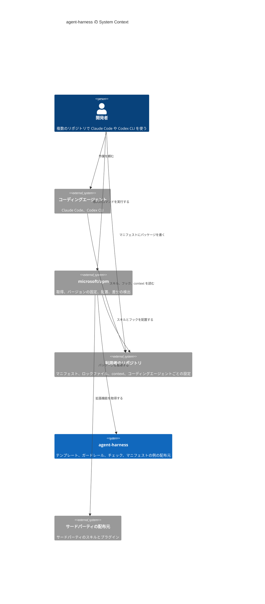

# agent-harness Design Doc

**Owner:** Fukuemon

**Reviewers:** 未定

## Overview

agent-harness は、4 つのパッケージと、それらが共有する schema と例を配るリポジトリである。  
パッケージは、共通の基盤の core と、文書の体系、開発プロセス、ガードレールの 3 つで、利用者はマニフェストに書いて導入する。core 以外は 1 つずつ選べる。  
利用者のリポジトリでは、パッケージのスキルとテンプレートとチェックが、Claude Code と Codex CLI の作業を支える。Cursor は可能な範囲で対応する。

- [PRD](../PRD.md) — 課題、目標、受け入れの条件

この文書は全体像だけを持つ。機能ごとの設計は、[Components](#components)の節から機能ごとの Design Doc へリンクする。

## Goals and Non-Goals

この設計が提供するものは、次の 4 つである。

- core 以外のパッケージを 1 つずつ導入でき、1 つずつ外せる。
- 特定のパッケージマネージャーに依存しない形式で配る。
- モデルが進化しても要る内容だけを持つ。プロジェクト固有の知識、ガードレール、自動チェック、開発プロセスの標準の 4 種類である。
- Claude Code と Codex CLI で、同じ context とガードレールが動く。

意図して作らないものは、次の 4 つである。

- 作業を次へ進める制御。ワークフローのハーネスに任せる。
- 特定のワークフローのハーネスを前提にした作り。どのハーネスとも衝突しない。
- 拡張機能の取得、配置、更新の仕組み。パッケージマネージャーに任せる。
- 利用者の知識の中身。テンプレートと書き方のルールだけを配り、中身は利用者が書く。

## Assumptions and Constraints

- Codex CLI と Cursor は AGENTS.md を読む。Claude Code は v2.1.277 以降、CLAUDE.md がないリポジトリで AGENTS.md を直接読む。CLAUDE.md がある場合は CLAUDE.md だけを読む。
  - 出典: [How Claude remembers your project](https://code.claude.com/docs/en/memory)
- 規約ファイルの指示は助言にとどまる。フックは必ず実行される。
  - 出典: [Best practices for Claude Code](https://code.claude.com/docs/en/best-practices)
- マニフェストとロックファイルによる再現、差分の検出、複数のコーディングエージェントへの配置は、公開のパッケージマネージャーが提供している。
- 境界は、コーディングエージェントの sandbox と権限の設定で引く。利用者が先に引き、パッケージはその内側で働く。ガードレールは境界の代わりにならない。

## Architecture

agent-harness のリポジトリは配布元である。  
取得と配置はパッケージマネージャーが行う。  
agent-harness のチェックは、利用者の環境を読み取るだけで変更しない。  
パッケージマネージャーで確認できないことのチェックは、実機で不足を確かめたものだけを、その時点で足す。

次の図は、パッケージマネージャーで導入する場合の、開発者、コーディングエージェント、agent-harness の関係を示す。  
コーディングエージェントの標準の方法と lefthook の remotes で導入する場合は、[Interfaces](#interfaces)の節に書いてある。



パッケージマネージャーには microsoft/apm を使う。  
マニフェストはリポジトリのルートの `apm.yml`、ロックファイルは `apm.lock.yaml` である。どちらも Git で管理する。

- ADR-0001: [拡張機能のパッケージマネージャーに microsoft/apm を使う](../adr/0001-management-tool.md)

サードパーティの拡張機能は、使うプロジェクトのマニフェストに書く。global には入れないことを既定にする。  
配置された拡張機能のファイルは Git で管理しない。clone の後に、導入のコマンドを 1 度実行する。

- ADR-0004: [サードパーティの拡張機能はプロジェクトの単位で宣言し、global は最小に保つ](../adr/0004-third-party-extensions.md)

パッケージマネージャーは 1 つだけ使う。  
複数を併用すると、同じスキルの置き場所、同じフックの設定、同じ規約ファイルへ書き込み、ロックファイルも複数になる。どれが正しいか分からなくなる。

パッケージは、特定のワークフローのハーネスを前提にしない。利用者がどのワークフローのハーネスを導入しても、衝突しない。

## Components

構成要素は、利用者のリポジトリの共通の基盤、4 つのパッケージ、パッケージが共有するものである。

### 共通の基盤

利用者のリポジトリの `context/` が、すべてのパッケージに共通の基盤である。

- `context/project.yml` は、機械が読む固有の値を持つ。3 つのパッケージのスクリプトは、ここから自分のキーを読む。
- `context/` の文書は、モデルが読む固有の事実を持つ。パッケージのスクリプトは読まない。AGENTS.md の指示から目次を経て、モデルが開く。
- 基盤を置くのはパッケージ core で、ほかのパッケージはそれを前提にする。どのパッケージを外しても、置いた `context/` は残る。

利用者のリポジトリに置く文書と、それを持つパッケージは次のとおり。

| 文書 | 内容 | 持つパッケージ |
| --- | --- | --- |
| `context/project.yml` | 機械が読む固有の値 | core |
| context | 技術スタックの規約、コードベースの構造の取り決め、運用の取り決め | core |
| AGENTS.md と CONTRIBUTING.md | 目次を読む指示と禁止事項。変更を取り込むまでの手順 | core |
| Design Doc と ADR | 現在の設計と、比較して決めた判断 | 文書の体系 |
| spec | issue ごとの要求、論点、決定の経緯。閉じたら削除する | 文書の体系 |
| `process.yml` | 要求ごとの選択と進み具合 | 開発プロセス |

### パッケージ

core 以外のパッケージは、core が置いた基盤だけを前提にし、互いに依存させない。1 つを外しても残りが動く。

- ADR-0013: [共通の基盤はパッケージ core に置き、ほかのパッケージはそれを前提にする](../adr/0013-core-package.md)

- **core:** 固有の知識の置き場を作る。値のファイルと schema、context のテンプレートと目次の生成、AGENTS.md と CONTRIBUTING.md のテンプレート、導入のスキルを持つ。
  - [core の Design Doc](../packages/core/DesignDoc.md)

- **文書の体系 `docs`:** Design Doc、ADR、spec の構造とテンプレート、実装とのずれの検出、spec の削除の保証、文書のチェックを持つ。利用者の知識の中身は持たない。内容の正しさは判定しない。
  - [文書の体系の Design Doc](features/documents/DesignDoc_documents.md)
- **開発プロセス `process`:** 開発のプロセスの定義、要求ごとの選択（行うプロセス、反映する時点、分解する時点、レビューの範囲）の項目と選択肢、宣言の schema と、プロセスの中で使う手段を持つ。手段は、コミットとブランチ名の規約、issue と pull request のテンプレート、コードのコメントの規約とフックである。作業を次へ進める制御は持たない。
  - [開発プロセスの Design Doc](features/process/DesignDoc_process.md)
- **ガードレール `guardrails`:** 取り返しのつかない操作を止める仕組みと、プロダクトごとに有効にする規則を持つ。規則は、保護ブランチ、禁止するコマンド、秘密情報である。コーディングエージェントの権限の仕組みそのものは実装しない。
  - [ガードレールの Design Doc](features/guardrails/DesignDoc_guardrails.md)

パッケージのスキルの名前は、他の拡張機能と重なりにくい語にする。パッケージマネージャーは、同じ名前のスキルを後から入れた側で警告なしに上書きするためである。

### パッケージが共有するもの

複数のパッケージが読むものと、利用者が写して使うものは、パッケージにしない。パッケージ同士を依存させないためである。

- **schema:** プロジェクトごとの値のファイルと、要求ごとの宣言のファイルの形を定める。`schemas/` に置く。値そのものは持たない。値のファイルの形は core の Design Doc が、宣言の形は開発プロセスの Design Doc が定める。
- **例:** 利用者が写して使うファイルの例。マニフェスト、値のファイル、CI の設定の例である。`examples/` に置く。取得、配置、更新は行わない。
- **スクリプトの実行環境:** チェックとフックのスクリプトは Node.js で書き、利用者には Node.js の 22.12 以上を前提にする。
  - ADR-0012: [チェックとフックのスクリプトは Node.js で書く](../adr/0012-node-runtime.md)

## Interfaces

### 導入の方法

パッケージは、Claude Code の形式のプラグインにする。中のスキルは、Agent Skills の形式で書く。  
Agent Plugins の公式のスキーマは宣言しない。宣言すると、パッケージマネージャーが Claude Code と Codex CLI へ配置しなくなる。

- ADR-0009: [パッケージは、用途ごとのプラグインとして packages/ の下に置く](../adr/0009-package-layout.md)
- 出典: [Agent Skills 仕様](https://agentskills.io/specification)

利用者がパッケージを導入する方法は、3 つある。

- **パッケージマネージャー:** マニフェストに `Fukuemon/agent-harness/packages/<名前>` とタグを書く。バージョンの固定と再現ができる。
- **コーディングエージェントの標準の方法:** ルートの一覧から、プラグインを選んで導入する。Claude Code はプロジェクトの単位で、Codex CLI は利用者の単位で導入する。Codex CLI では global への導入になるため、構成の再現には向かない。
- **lefthook の `remotes`:** Git のフックを使うパッケージで、利用者が自分の `lefthook.yml` に、このリポジトリの URL とタグを書く。

利用者のリポジトリへ写すテンプレートは、スキルの `assets/` に置く。スキルが、利用者の求めに応じて写す。  
パッケージマネージャー専用の形式は、マニフェストの例だけに使う。パッケージの本体には使わない。

### 導入の流れ

パッケージマネージャーが入れるのは、コーディングエージェントが読むスキルとフックだけである。共通の基盤と、利用者が写して使うファイルは、別の手段で入れる。

1. マニフェストにパッケージを書き、`apm install` を実行する。スキルとフックが配置される。Git で管理しない。
2. core の導入のスキルを呼ぶ。スキルが保護ブランチの名前や置く context の話題を尋ね、付属のスクリプトが `context/project.yml`、AGENTS.md、CONTRIBUTING.md と、配置されているパッケージのテンプレートを写す。存在するファイルは上書きしない。
3. 写されたファイルをコミットする。以後は利用者のものとして編集する。
4. Git のフックを使うなら、`lefthook.yml` に remotes を書き、`lefthook install` を実行する。

core を入れない利用者は、`examples/project.yml` を `context/` へ手で写す。

### 利用者のリポジトリに置く値のファイル

プロジェクトごとの値は、利用者のリポジトリの `context/project.yml` に置く。  
パッケージのスキルとチェックは、このファイルから値を読む。キーと schema は、[core の Design Doc](../packages/core/DesignDoc.md) にある。

ツールの具体は扱わない。  
リポジトリの管理や作業ツリーの管理に何を使うかは、利用者に委ねる。利用者が context に書いた内容は、モデルが解釈する。  
ツールごとのパッケージを作ると、パッケージの数が、利用者の使うツールの数に比例して増えるためである。

- パッケージの本文に、製品名、リポジトリ名、コマンド、利用者によって違うツールの名前を直接書かない。このリポジトリの CI が、語の一覧と照らして確認する。語の一覧は `prh.yml` に持つ。

## Cross-Cutting Concerns

### ルールの持ち方

ルールは、機械で判定できるかどうかで持ち方を分ける。

- 機械で判定できるルールは、自動チェックで持つ。スキルや AGENTS.md には、同じルールを書かない。
  - ADR-0005: [自動でチェックできるルールは textlint などに任せ、できないルールは 1 つのスキルにまとめる](../adr/0005-rules-by-check-or-skill.md)
- 機械で判定できないルールは、領域ごとに 1 つのスキルにまとめる。文章、コミット、コードのコメントが領域の例である。
  - ADR-0006: [意味の判定が要るルールには、任意の追加として Jev を使う](../adr/0006-semantic-check.md)
- フックで毎回コンテキストを追加するパッケージは作らない。毎回の注入に向くのは、文体のように毎回の応答で守らせたいものだけである。事実とチェックは、読まれなかった結果をチェックで検出する。
- フックは、編集もコミットも拒否しない。拒否するのは、ガードレールだけである。それ以外のフックは、確かめるよう促す文をコンテキストに追加するに留める。
- 同じことを 2 か所で指示しない。サードパーティのスキルやプラグインを入れるときは、既にあるルールと重ならないことを確かめる。
- モデルが指示なしで行うことは、どこにも書かない。

### ガードレール

- 取り返しのつかない操作は、モデルが指示を守るかどうかに関係なく止める。コーディングエージェントのツール実行前のフックと、Git のフックの両方で判定する。
- 許す場面は、利用者がプロジェクトごとの値で宣言する。既定は拒否。自動で検出する条件は持たない。
  - ADR-0011: [保護ブランチへの直接コミットは、プロジェクトごとの値での宣言だけで許す](../adr/0011-direct-commit-declaration.md)
- 保護ブランチを変更しない操作は拒否しない。同期や作業ツリーの復元まで止めると、ガードレールそのものが外される。
- コーディングエージェントごとにフックの仕組みが違う。フックが必ず実行される保証のないコーディングエージェントでは、Git のフックだけが働く。対応は、確認したバージョンとともに README の対応表に記録する。

## Repository Layout

```text
agent-harness/
├── .claude-plugin/
│   └── marketplace.json        パッケージの一覧
├── packages/
│   └── <パッケージの名前>/    core、docs、process、guardrails
│       ├── .claude-plugin/
│       │   └── plugin.json
│       ├── DesignDoc.md        機能ごとの Design Doc。パッケージを作った時点で design/features/ から移す
│       ├── skills/
│       │   └── <スキルの名前>/
│       │       ├── SKILL.md
│       │       └── assets/     利用者のリポジトリへ写すテンプレート
│       └── hooks/              hooks.json と、フックが呼ぶスクリプト
├── lefthook/
│   └── <パッケージの名前>.yml  lefthook の remotes で配る設定
├── .lefthook/                  Git のフックが呼ぶスクリプト
├── schemas/
│   ├── project.schema.json     プロジェクトごとの値
│   └── process.schema.json     要求ごとの宣言
├── examples/
│   ├── apm.yml                 マニフェストの例
│   ├── project.yml             値のファイルの例
│   └── ci/                     spec の HTML の公開と、削除の pull request を作る CI の設定の例
├── skills/                     このリポジトリの開発に使うスキル
├── design/
│   ├── DesignDoc.md            全体像
│   └── features/
│       └── <機能名>/
│           └── DesignDoc_<機能名>.md
├── context/                    このリポジトリの運用の取り決め
├── adr/
├── CONTRIBUTING.md             開発の準備
├── README.md                   導入の方法と、コーディングエージェントごとの対応表
├── PRD.md
├── apm.yml
└── apm.lock.yaml
```

- パッケージは、`packages/` の下に 1 つずつ置く。形は Claude Code の形式のプラグインである。
  - ADR-0009: [パッケージは、用途ごとのプラグインとして packages/ の下に置く](../adr/0009-package-layout.md)
- ルートの一覧は、Claude Code と Codex CLI の標準の方法で導入する利用者が使う。
- Git のフックの設定は `lefthook/` に、Git のフックが呼ぶスクリプトは `.lefthook/` に置く。lefthook の `remotes` は、配る側のリポジトリのルートにあるスクリプトだけを配れる。
- パッケージ同士は依存させない。
