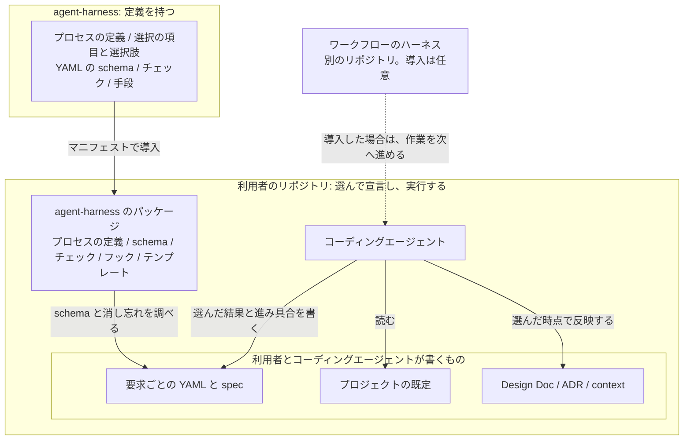

# 開発プロセス

## 概要

パッケージ「開発プロセス」の設計。全体像は [agent-harness Design Doc](../../DesignDoc.md) にある。  
開発のプロセスの種類、要求ごとの選択（行うプロセス、反映する時点、分解する時点、レビューの範囲）、選んだ結果の宣言を定める。

開発プロセスの標準は、このリポジトリで管理する。  
ワークフローのハーネスは、作業をいつ、どの順に進めるかを制御する拡張機能のまとまりである。  
具体のワークフローのハーネスは、別のリポジトリで管理する。

- ADR-0008: [開発プロセスの標準はこのリポジトリに置き、具体のワークフローのハーネスは別のリポジトリに置く](../../../adr/0008-workflow-harness.md)

## 範囲

- 持つのは、プロセスの定義、選択の項目と選択肢、YAML の schema、チェック、プロセスの中で使う手段である。手段は、コミットとブランチ名の規約のスキル、issue と PR のテンプレート、コードのコメントの規約のスキルと編集後のフックである。
- 分類: 開発プロセスの標準。
- 作業を次へ進める制御は持たない。利用者のリポジトリで作業を進めるのは、人とコーディングエージェントである。
- ワークフローのハーネスの導入は、任意である。導入した場合は、ワークフローのハーネスが宣言を読んで、作業を次へ進める。ワークフローのハーネスは、このリポジトリのパッケージに依存する。
- 利用者は、マニフェストの行で、ワークフローのハーネスを選ぶ。自作のものも、サードパーティのものも、同じ書き方で導入できる。

## 設計

開発のプロセスは、種類と、要求ごとの選択だけを定める。  
選んだ結果は、YAML で宣言する。

- ADR-0010: [開発のプロセスは種類と要求ごとの選択だけを定め、選んだ結果は YAML で宣言する](../../../adr/0010-process-and-tailoring.md)

### プロセス

プロセスは、要件定義、設計、実装、検証の設計、検証の実施、取り込み、リリースの 7 つとする。

- それぞれに、目的、成果物、完了の条件を定める。
- 順序は定めない。繰り返すことも、並行して行うことも、前のプロセスへ戻ることも認める。
- レビューは、どのプロセスにも付けられる共通の仕組みとする。レビュー用の HTML への変換は、どのプロセスのレビューでも使える。
- プロセスを足すかどうかは、利用者が決める。足すプロセスは、値のファイルの `process.additional` に、同じ 4 つの項目で書く。

識別子は英字の slug で、YAML の値と schema に使う。文書では日本語の名前で呼ぶ。

| 識別子 | 名前 | 目的 | 成果物 | 完了の条件 |
| --- | --- | --- | --- | --- |
| `requirements` | 要件定義 | 何を、誰のために、どこまで作るかを決める | spec の要求と受け入れ基準 | 受け入れ基準が書かれている。レビューを選んだなら、承認されている |
| `design` | 設計 | どう作るかを決め、比較した判断を残す | spec の設計。比較した判断の ADR | 設計が spec にある。反映する時点に選んだなら、Design Doc と ADR へ移されている |
| `implementation` | 実装 | 設計をコードと文書にする | 作業用のブランチの変更 | 受け入れ基準の各項目に対応する変更がある |
| `verification-design` | 検証の設計 | 何をどう確かめるかを決める | 確かめ方の一覧。自動のテストと、手動の手順 | 受け入れ基準の各項目に、確かめ方が対応づいている |
| `verification` | 検証の実施 | 受け入れ基準を満たすことを確かめる | 実行の結果。CI の結果と、手動の記録 | すべての確かめ方が実行され、失敗が残っていない |
| `integration` | 取り込み | 変更を基準のブランチへ入れる | 取り込まれた変更の依頼 | 変更の依頼が取り込まれ、issue が閉じられている |
| `release` | リリース | 利用者が使える形にする | タグとリリースの記述 | タグが付き、リリースの記述が公開されている |

レビューは、選んだプロセスの成果物を、人が確認して承認する。レビューを選んだプロセスは、承認をもって完了とする。

### 要求ごとの選択

要求ごとの選択は、次の 4 つである。それぞれに、選択肢と既定の値を定める。

- どのプロセスを行うか。
- Design Doc と ADR へ反映する時点。
- タスクへの分解と、実装の issue の起票の時点。
- レビューの要否と範囲。

タスクの種類ごとの流れは用意しない。種類の違いは、この 4 つの組み合わせで表す。

値の形は次のとおり。

| キー | 値 | 意味 |
| --- | --- | --- |
| `processes` | 識別子の一覧 | 行うプロセス。順序は表さない |
| `reflect_at` | 識別子か `none` | そのプロセスの完了の後に、Design Doc と ADR へ反映する。`none` は反映しない |
| `breakdown_at` | 識別子か `none` | そのプロセスの完了の後に、タスクへ分解して issue を起票する。`none` は起票しない |
| `review` | 識別子の一覧 | レビューして承認を得るプロセス。空なら、レビューしない |

時点を「プロセスの完了の後」で表すのは、レビューを選んだプロセスが承認をもって完了するためである。「設計のレビューの後」は `design` と書く。

次の表は、組み合わせの例である。

| 要求の例 | `processes` | `reflect_at` | `breakdown_at` | `review` |
| --- | --- | --- | --- | --- |
| 誤記の修正 | `[implementation, integration]` | `none` | `none` | `[integration]` |
| 新しい機能の追加 | 7 つすべて | `design` | `design` | `[requirements, design, integration]` |
| 試さないと設計が決まらない性能の改善 | 7 つすべて | `verification` | `requirements` | `[design, verification, integration]` |

### 宣言

選んだ結果は、YAML で宣言する。

- プロジェクトの既定は、プロジェクトごとの値のファイルの `process.defaults` に書く。
  - [プロジェクトごとの値の Design Doc](../values/DesignDoc_values.md)
- 要求ごとの選択と、プロセスごとの進み具合は、要求ごとの YAML に書く。spec と同じ場所に置く。
- 要求ごとの YAML と spec は、Git で管理する。issue を閉じる時点で、一緒に削除する。
- YAML の schema を提供する。schema に合わない宣言は、チェックが報告する。
- 宣言は、現在の状況の記録である。一方向の状態遷移としては扱わない。前のプロセスへ戻った場合は、進み具合を書き直す。

要求ごとの YAML の形は次のとおり。ファイル名は `process.yml` で、spec のディレクトリに置く。

```yaml
version: 1
issue: 42
processes: [requirements, design, implementation, verification-design, verification, integration, release]
reflect_at: design
breakdown_at: design
review: [requirements, design, integration]
progress:
  requirements: done
  design: in-progress
  implementation: pending
  verification-design: pending
  verification: pending
  integration: pending
  release: pending
```

- `version` は schema の版。`issue` は対応する issue の番号。
- 4 つの選択は、プロジェクトの既定と同じキーで書く。要求ごとの値が、既定より優先する。
- schema は `schemas/process.schema.json` に置く。`processes`、`reflect_at`、`breakdown_at`、`review` に書ける識別子は、7 つのプロセスと `process.additional` の識別子に限る。`progress` のキーは `processes` の中に限る。この検証は、`project.yml` を読んだ上で行う。
- `progress` は、`processes` にあるプロセスごとに 1 つ持つ。値は `pending`、`in-progress`、`done`、`on-hold` の 4 つである。
  - `pending` は着手前、`in-progress` は作業中、`done` は完了の条件を満たした状態、`on-hold` は判断待ちである。
  - 前のプロセスへ戻ったときは、そのプロセスを `in-progress` に書き直す。`done` に戻す条件は、完了の条件と同じである。

### 実装と取り込みの手段

- コミットの規約とブランチ名の形式は、スキルに書く。メッセージの形式は commitlint のような自動チェックに任せ、スキルには判断が要ることだけを書く。
- issue と PR のテンプレートは、利用者のリポジトリへ写す。
- コードのコメントの規約は、スキルと、ファイルの編集の後のフックで持つ。フックは、コメントが足されたときだけ、残してよいかを確かめるよう促す文をコンテキストに追加する。編集は拒否しない。サブエージェントの中でも動く。

### agent-harness と利用者のリポジトリの分担

次の図は、定義を持つ agent-harness と、選んで宣言して実行する利用者のリポジトリの分担を示す。  
点線は、任意の導入を表す。



### 利用者のリポジトリでの 1 つの要求の流れ

作業は、すべて利用者のリポジトリの中で進む。  
agent-harness から導入したものは、チェックとして働く。  
ワークフローのハーネスを導入した場合は、ハーネスが宣言を読んで、この流れを進める。

次の図は、コーディングエージェントが作業を進める場合に、1 つの要求を宣言してから片づけるまでの流れを示す。


## 利用者のリポジトリでの形

- 置くファイル: 要求ごとの `process.yml`。spec のディレクトリに置く。
- 置くファイル: issue と PR のテンプレート。ホスティングサービスの決まりの場所に写す。
- 読む値: `process.defaults`。要求ごとの選択の既定。
- 動くチェック: 宣言の形式。プロジェクトの既定と `process.yml` が `schemas/process.schema.json` に合うかを確認する。CI と、`process.yml` を編集した後のフックで動く。
- 動くフック: コードのコメントの編集後のフック。
