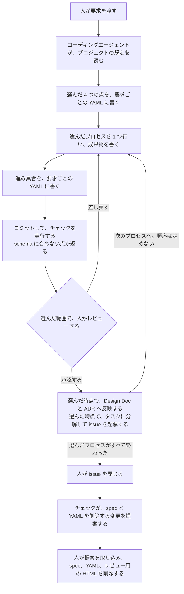

# 開発プロセス

パッケージ「開発プロセス」の設計。全体像は [agent-harness Design Doc](../../DesignDoc.md) にある。

開発プロセスの標準は、このリポジトリで管理する。  
ワークフローのハーネスは、作業をいつ、どの順に進めるかを制御する拡張機能のまとまりである。  
具体のワークフローのハーネスは、別のリポジトリで管理する。

- ADR-0008: [開発プロセスの標準はこのリポジトリに置き、具体のワークフローのハーネスは別のリポジトリに置く](../../../adr/0008-workflow-harness.md)

開発のプロセスは、種類と、要求ごとに決める点だけを定める。  
選んだ結果は、YAML で宣言する。

- ADR-0010: [開発のプロセスは種類と決める点だけを定め、選んだ結果は YAML で宣言する](../../../adr/0010-process-and-tailoring.md)

## プロセス

プロセスは、要件定義、設計、実装、検証の設計、検証の実施、取り込み、リリースの 7 つとする。

- それぞれに、目的、成果物、完了の条件を定める。
- 順序は定めない。繰り返すことも、並行して行うことも、前のプロセスへ戻ることも認める。
- レビューは、どのプロセスにも付けられる共通の仕組みとする。レビュー用の HTML への変換は、どのプロセスのレビューでも使える。
- プロセスを足すかどうかは、利用者が決める。

## 要求ごとに決める点

次の 4 つに、選択肢と既定の値を定める。

- どのプロセスを行うか。
- Design Doc と ADR へ反映する時点。
- タスクへの分解と、実装の issue の起票の時点。
- レビューの要否と範囲。

タスクの種類ごとの流れは用意しない。種類の違いは、この 4 つの組み合わせで表す。

次の表は、組み合わせの例である。

| 要求の例 | 行うプロセス | Design Doc と ADR へ反映する時点 | タスクへの分解と起票の時点 | レビューの要否と範囲 |
| --- | --- | --- | --- | --- |
| 誤記の修正 | 実装、取り込み | 反映なし | 起票なし | 取り込みだけ |
| 新しい機能の追加 | 7 つすべて | 設計のレビューの後 | 設計のレビューの後 | 要件定義、設計、取り込み |
| 試さないと設計が決まらない性能の改善 | 7 つすべて | 検証の実施の後 | 要件定義の後 | 設計、検証の実施、取り込み |

## 宣言

選んだ結果は、YAML で宣言する。

- プロジェクトの既定は、プロジェクトごとの値のファイルに書く。
- 要求ごとの選択と、プロセスごとの進み具合は、要求ごとの YAML に書く。spec と同じ場所に置く。
- 要求ごとの YAML と spec は、Git で管理する。issue を閉じる時点で、一緒に削除する。
- YAML の schema を提供する。schema に合わない宣言は、チェックが報告する。
- 宣言は、現在の状況の記録である。一方向の状態遷移としては扱わない。前のプロセスへ戻った場合は、進み具合を書き直す。

## このリポジトリが持つ範囲

- 持つのは、プロセスの定義、決める点と選択肢、YAML の schema、チェック、プロセスの中で使う手段である。手段は、スクリプト、フック、テンプレートである。
- 作業を次へ進める制御は持たない。利用者のリポジトリで作業を進めるのは、人とコーディングエージェントである。
- ワークフローのハーネスの導入は、任意である。導入した場合は、ワークフローのハーネスが宣言を読んで、作業を次へ進める。ワークフローのハーネスは、このリポジトリのパッケージに依存する。
- 利用者は、マニフェストの行で、ワークフローのハーネスを選ぶ。自作のものも、サードパーティのものも、同じ書き方で導入できる。

次の図は、定義を持つ agent-harness と、選んで宣言して実行する利用者のリポジトリの分担を示す。  
点線は、任意の導入を表す。

## 利用者のリポジトリでの 1 つの要求の流れ

作業は、すべて利用者のリポジトリの中で進む。  
agent-harness から導入したものは、チェックとして働く。  
ワークフローのハーネスを導入した場合は、ハーネスが宣言を読んで、この流れを進める。

次の図は、コーディングエージェントが作業を進める場合に、1 つの要求を宣言してから片づけるまでの流れを示す。

