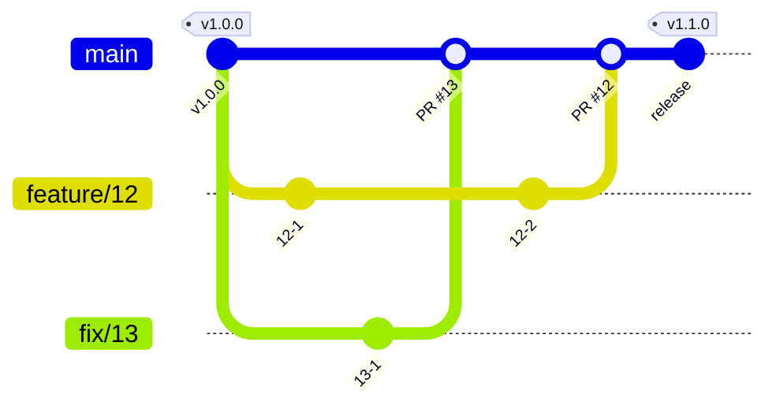

# 開発の準備

<!-- 必要なランタイムとツールの名前と版、最初に実行するコマンドを書く。手順は 1 度覚えれば済むものだけにし、繰り返し参照する規約は context/ へリンクする -->

## 文書を直すとき

<!-- 文書のチェックの実行方法を書く。パッケージ docs を入れていれば、そのチェックのコマンド -->

## コミットするとき

<!-- コミットの前に動くチェックと、その直し方を書く -->

- 変更の分け方とメッセージの書き方は、スキル git-commit に従う。

<!-- パッケージ process を入れていなければ、上の行を消して、ここに規則を書く -->

## ブランチとリリース

<!-- 次は既定の運用である。運用が違えば、本文と図を書き換える。保護するブランチの名前は context/project.yml の guardrails.protected_branches と揃える -->

ブランチは、`main` と、issue ごとの作業用のブランチだけにする。

- 作業用のブランチの名前は `feature/<issue 番号>` にする。不具合は `fix/<issue 番号>` にする。
- `main` へは、pull request を通して取り込む。
- `main` へ直接コミットしてよいかは、`context/project.yml` の `guardrails.protected_branches.direct_commit` で宣言する。

バージョンは、`main` のコミットにタグで付ける。`main` は常にリリースできる状態に保つ。

## issue と pull request

- 作業は issue から始める。pull request は 1 つの issue に対応させる。
- 題と本文の書き方は、スキル issue-pr-writing に従う。

<!-- パッケージ process を入れていなければ、上の行を消して、ここに規則を書く -->
